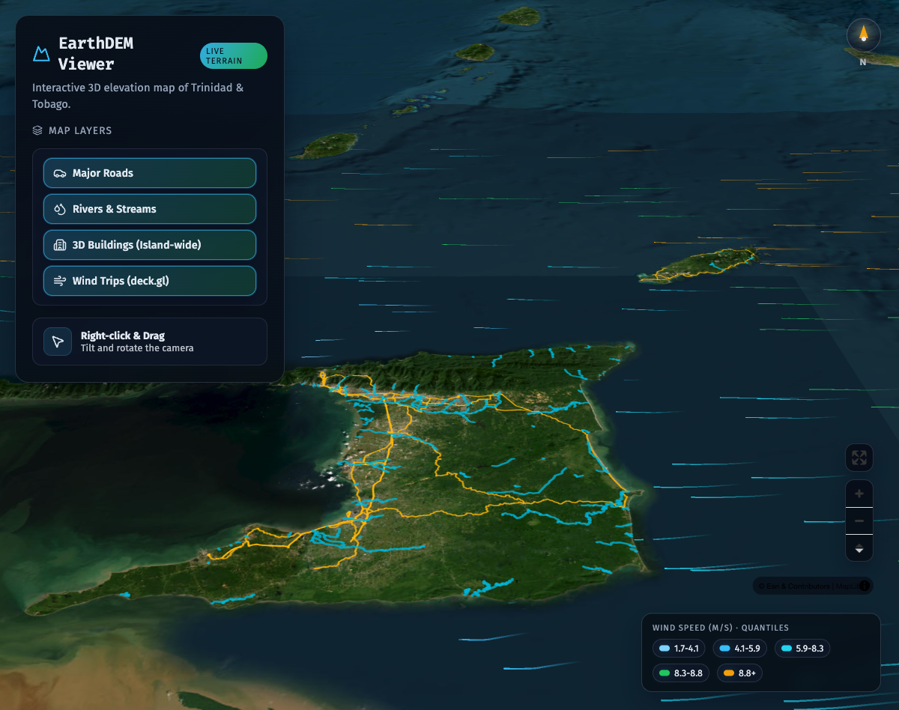

# Fast DEM Trinidad

A browser-based 3D terrain and wind exploration prototype for Trinidad & Tobago.
DEM means **digital elevation model**. This is a visualization, with exaggerated
terrain, illustrative building heights, and animated wind trails; it is not a
surveying or operational weather tool.

[Live demo](https://gregory1506.github.io/fast-dem-trini/) ·
[October hackathon brief and tasks](docs/HACKATHON.md) ·
[Repository critique](docs/REPO_REVIEW.md) · [Contributing](CONTRIBUTING.md)



## Start here

Use Node **22.19.x or a later 22.x release**, npm, and a WebGL-capable browser.
No API keys, Python, database, or account are needed to run the app.

```sh
nvm install
nvm use
npm ci
npm run dev
```

If you do not use nvm, install the Node version in `.nvmrc` with your preferred
version manager. Open the URL Vite prints, including `/fast-dem-trini/`.

For repeatable wind data without contacting Open-Meteo, open
`http://localhost:5173/fast-dem-trini/?demo=1` (adjust port if Vite reports another).
**Demo mode only replaces wind data. Satellite and elevation tiles still need
internet access.** Roads, rivers, and buildings are checked into `public/`.
Wind trails start disabled; enable them in the layer panel.

Enable **Recent Earthquakes** for the [USGS past-30-days feed](https://earthquake.usgs.gov/earthquakes/feed/v1.0/geojson.php),
filtered to the map region. Circle size indicates magnitude and colour indicates
depth. Click a marker or use the event selector for details in Trinidad time.
The feed refreshes every five minutes while enabled, including in wind demo mode.
An empty region is shown explicitly; failed refreshes keep the previous data with
a stale-data message. Coverage reflects events reported by USGS.

```sh
npm run check    # zero-warning lint + network-free tests + TypeScript/build
npm run preview  # serve the production build after npm run check
```

## What is here

- MapLibre terrain with Esri imagery and Terrarium elevation tiles; 1.5× vertical exaggeration.
- Roads, rivers, and building footprints from local GeoJSON. Building heights are fixed at 15 m.
- deck.gl wind trails, hourly Open-Meteo GFS input, and quantile color bands.
- Recent USGS earthquakes with magnitude/depth markers, event details and automatic refresh.
- Desktop tilt/rotate using right-click and drag; mobile layer drawer and touch navigation.
- Wind-source/timestamp label, explicit synthetic fallback, and a wind demo mode.

See [architecture and data notes](docs/ARCHITECTURE.md) before changing the map.
The older custom WebGL particle renderer remains in the repo but is not used by the app.

## October 2026 hackathon

Start with [the event brief](docs/HACKATHON.md). It contains a proposed one-day
schedule, beginner/intermediate/advanced tasks, acceptance criteria, and a
pre-event checklist. Dates, team size, and participants remain organizer decisions.
The proposed format is a repo improvement competition: teams submit tested changes
and a two-minute demo. Maintainers decide what to merge after judging.

## Deployment and data

[Deployment instructions](docs/deployment.md) describe the existing GitHub Pages
workflow. Forks must update the Vite base path. Pull requests run quality checks;
`main` runs checks before deployment. Publishing requires GitHub Pages to be enabled.

See [data inventory](docs/DATA.md) for source URLs, coverage, sizes, and known gaps.
MIT applies to the code; third-party datasets and imagery have their own terms.
See [LICENSE](LICENSE).
